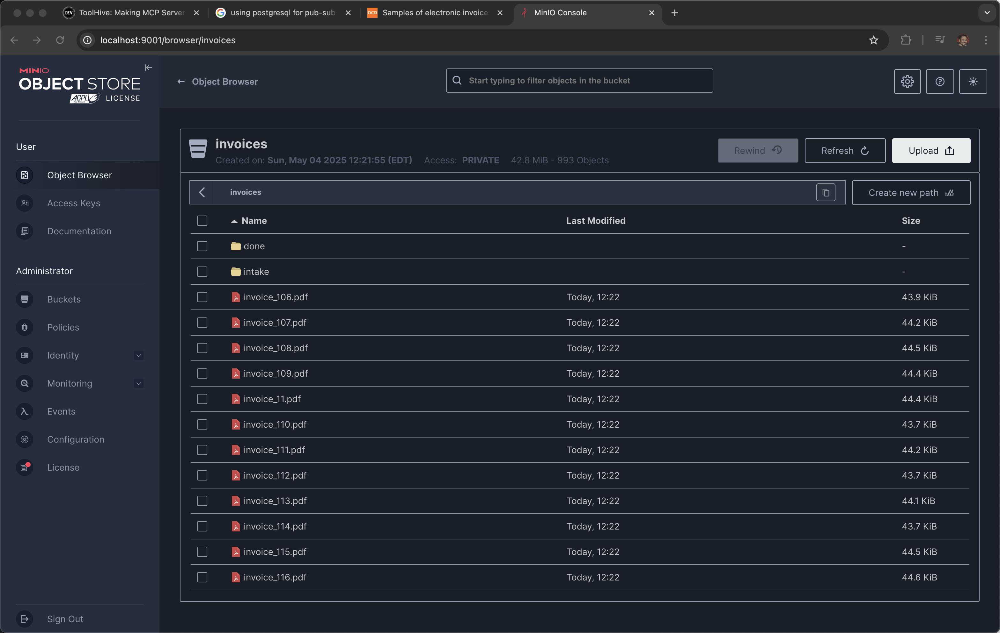

# S3

Uses S3 APIs and minio for an inbox/outbox 

## Minio Setup

```
brew install minio/stable/minio
```

```
mkdir ~/minio-data
```

```
minio server ~/minio-data --console-address :9001
```

```
open http://localhost:9001
```

Default
user: minioadmin
password: minioadmin

### mc CLI

```
brew install minio/stable/mc
```

Set the alias so the API endpoint

```
mc alias set myminio http://127.0.0.1:9000 minioadmin minioadmin
```

```
mc admin info myminio
```

```
●  127.0.0.1:9000
   Uptime: 12 minutes
   Version: 2025-04-22T22:12:26Z
   Network: 1/1 OK
   Drives: 1/1 OK
   Pool: 1

┌──────┬────────────────────────┬─────────────────────┬──────────────┐
│ Pool │ Drives Usage           │ Erasure stripe size │ Erasure sets │
│ 1st  │ 21.3% (total: 1.8 TiB) │ 1                   │ 1            │
└──────┴────────────────────────┴─────────────────────┴──────────────┘

1 drive online, 0 drives offline, EC:0
```

#### CRUD


##### Create
```
mc mb myminio/mybucket
```

##### Read
```
mc ls myminio
```

```
[2025-05-04 11:30:57 EDT]     0B mybucket/
```

##### Update
```
mc cp ./test.txt myminio/mybucket/test.txt
```

```
mc ls myminio/mybucket
```

```
[2025-05-04 11:31:29 EDT]    43B STANDARD test.txt
```

```
mc cp --recursive ./source-files/ myminio/mybucket/
```

```
mc ls myminio/mybucket
```

```
[2025-05-04 11:37:08 EDT]     3B STANDARD 1.txt
[2025-05-04 11:37:08 EDT]     3B STANDARD 2.txt
[2025-05-04 11:37:08 EDT]     5B STANDARD 3.txt
[2025-05-04 11:31:29 EDT]    43B STANDARD test.txt
```

##### Delete

```
mc rm myminio/mybucket/test.txt
```

```
mc ls myminio/mybucket
```

```
[2025-05-04 11:37:08 EDT]     3B STANDARD 1.txt
[2025-05-04 11:37:08 EDT]     3B STANDARD 2.txt
[2025-05-04 11:37:08 EDT]     5B STANDARD 3.txt
```

##### Update Again

```
mc mb myminio/anotherbucket
```

```
mc put ./test.txt myminio/anotherbucket/test.txt
```

```
mc ls myminio/anotherbucket
```

##### Move and rename a file

```
mc mb myminio/3rdbucket
```

```
mc ls myminio
```

```
[2025-05-04 11:45:46 EDT]     0B 3rdbucket/
[2025-05-04 11:40:27 EDT]     0B anotherbucket/
[2025-05-04 11:30:57 EDT]     0B mybucket/
```

```
mc mv myminio/anotherbucket/test.txt myminio/3rdbucket/test.txt.done
```

```
mc ls myminio/anotherbucket
```

```
mc ls myminio/3rdbucket
```

```
[2025-05-04 11:46:27 EDT]    43B STANDARD test.txt.done
```

## Load with Invoices

https://prod-dcd-datasets-cache-zipfiles.s3.eu-west-1.amazonaws.com/tnj49gpmtz-1.zip

```
curl -o invoices.zip https://prod-dcd-datasets-cache-zipfiles.s3.eu-west-1.amazonaws.com/tnj49gpmtz-1.zip
```

# Create a temporary directory
```
temp_dir=$(mktemp -d)
```

# Extract the zip file into the temporary directory
```
unzip invoices.zip -d "$temp_dir"
```

```
mkdir invoices
```

# Move the contents from the top-level directory to the current directory
```
mv "$temp_dir/Samples of electronic invoices/"* ./invoices/
```

# Remove the temporary directory
```
rm -r "$temp_dir"
```

```
mc mb myminio/invoices
```

```
mc mb myminio/invoices/intake
```

```
mc mb myminio/invoices/done
```

```
mc cp --recursive ./invoices/ myminio/invoices/
```



#### Clean up

```
mc rb --force myminio/invoices
```

## Python


```
pip install boto3
```

```
export S3_ENDPOINT_URL="http://localhost:9000"
export S3_ACCESS_KEY_ID="minioadmin"
export S3_SECRET_ACCESS_KEY="minioadmin"
```

List buckets

```
python scripts/list-buckets.py
```

```
3rdbucket
anotherbucket
invoices
mybucket
```


Create a bucket

```
python scripts/create-bucket.py
```

```
python scripts/list-buckets.py
```

```
3rdbucket
anotherbucket
invoices
mybucket
mypythonbucket
```

Monitor and process files with intake-processor.py

### Installation

Install the required packages:
```
pip install aioboto3 docling
```

### Bucket Setup

Set up the required bucket structure:
```
# Create main bucket if it doesn't exist
mc mb myminio/invoices

# Create prefixes for intake, done, error, and json output
mc mb myminio/invoices/intake
mc mb myminio/invoices/done
mc mb myminio/invoices/error
mc mb myminio/invoices/json
```

### PDF to JSON Conversion

The system now includes PDF to JSON conversion using the `docling` library:

1. `docling_conversion.py` - Handles the conversion of PDF files to JSON format
2. `intake-processor.py` - Monitors the bucket and processes incoming files

When a PDF file is detected in the intake prefix:
- The file is converted to JSON using the DocumentConverter
- The JSON result is stored in the `json/` prefix
- The original PDF is moved to the `done/` prefix with a `.done` suffix
- If conversion fails, the PDF is moved to the `error/` prefix with an `.error` suffix

### Running the Processor

Start the processor script:
```
python scripts/intake-processor.py
```

The script will:
1. Monitor the `invoices` bucket with the `intake/` prefix
2. Process any files found in that location (convert PDFs to JSON)
3. Store JSON results in the `json/` prefix
4. Move successfully processed files to the `done/` prefix with a `.done` suffix
5. Move files that failed processing to the `error/` prefix with an `.error` suffix

### Testing

To test the processor, copy a PDF file into the intake prefix:
```
mc cp myminio/invoices/invoice_2.pdf myminio/invoices/intake/
```

You should see the file being processed and:
1. The JSON output will be stored in `myminio/invoices/json/invoice_2.json`
2. The original PDF will be moved to `myminio/invoices/done/invoice_2.pdf.done`

Check the results:
```
# Check JSON output
mc ls myminio/invoices/json

# Check processed files
mc ls myminio/invoices/done
```

Example output:
```
[2025-05-04 12:22:14 EDT]     0B STANDARD /
[2025-05-04 13:57:41 EDT]  45KiB STANDARD invoice_999.pdf.done
```

Check the error prefix (should be empty if processing was successful):
```
mc ls myminio/invoices/error
```

Check the intake prefix (should be empty after processing):
```
mc ls myminio/invoices/intake
```

### Retrieving JSON Results

To retrieve a JSON file:
```
mc cat myminio/invoices/json/invoice_999.json
```